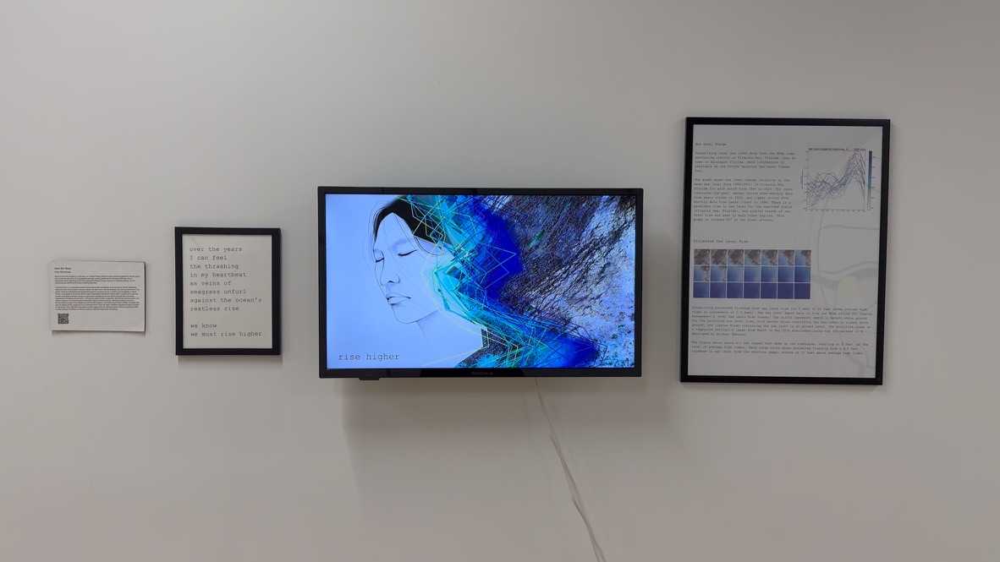
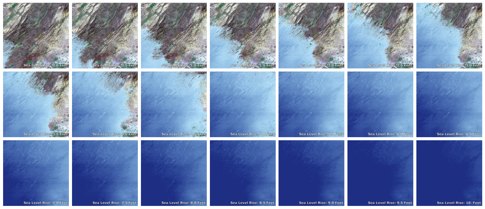
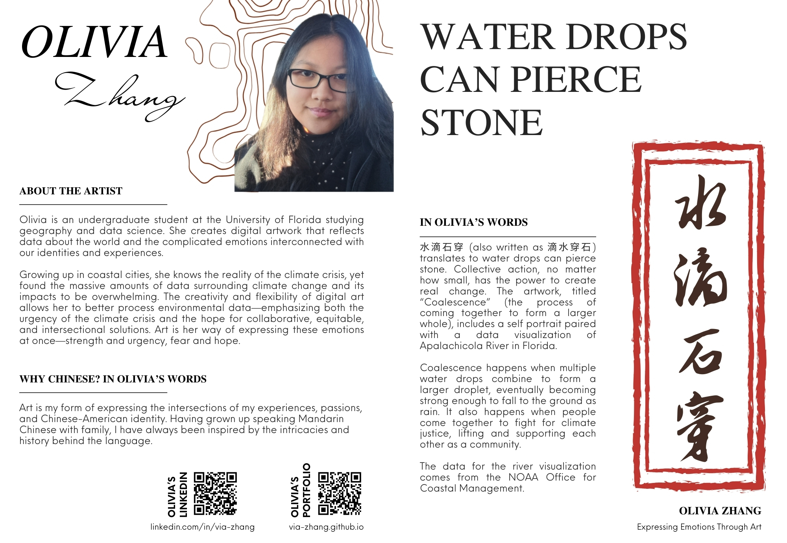
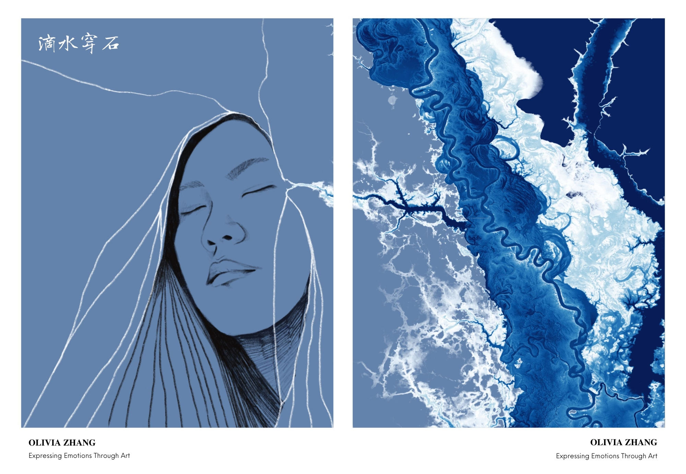

I’ve loved creating art ever since I was young. Tables stained with color, scattered paintbrushes and pens, sketches on any piece of paper I could find. Art was an opportunity for me to explore the world and bring ideas to life.

Now, I bring this creativity with me in my work. Designing maps, visualizing data, and communicating science. This led me to explore different ways to integrate geospatial data into art.

## Over the Years: Sea Level Rise Storytelling

"Over the Years" is a multimedia artwork that explores data visualization as an avenue for climate storytelling. Inspired by the role of location—how we interact with each other, with our histories, and with our environment—this artwork features a timelapse of projected flooding from sea level rise up to 10 feet in the Everglades in South Florida, a line graph of sea levels off the coast of Southeast Florida from 1994 to 2023, overlaid with a personal portrait. Accompanying these visuals is a short poem that delves into my emotions regarding the escalating climate crisis.

As part of the Climate Storytelling 2075 Anthology, "Over the Years" was on display in Queens, New York at the Queens Council on the Arts in partnership with Ofrenda Fest from September to December 2024. It was also showcased in the [digital anthology](https://climatefutures.art/over-the-years) and posted by the Climate Museum on social media.

The figure above shows all the images that make up the timelapse, starting at 0 feet (at the level of average high tides). Each image after shows projected flooding from a 0.5 feet increase in sea level from the previous image, ending at 10 feet above average high tides.

## Water Drops Can Pierce Stone: Chengyu (成语) for Change

水滴石穿 (also written as 滴水穿石) translates to water drops can pierce stone. Collective action, no matter how small, has the power to create real change. The artwork, titled “Coalescence” (the process of coming together to form a larger whole), includes a self portrait paired with a data visualization of Apalachicola River in Florida. 

Coalescence happens when multiple water drops combine to form a larger droplet, eventually becoming strong enough to fall to the ground as rain. It also happens when people come together to fight for climate justice, lifting and supporting each other as a community. 

The data for the river visualization comes from the NOAA Office for Coastal Management and was processed with Python and mapped with ArcGIS Pro. This artwork was featured in the Chengyu for Change zine with a workshop about environmental futures hosted at the Miami Beach Regional Library.

## Geospatial Data in Art

I thought I would have to give up art when I started college, until I realized that I am still creating art, just in a different form. Art is something that will always be a part of my life, present in the maps made, data visualized, and stories told.
