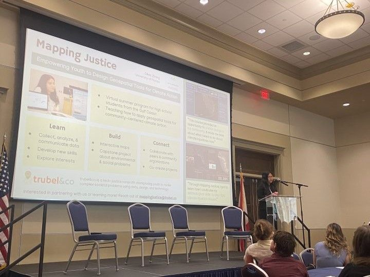
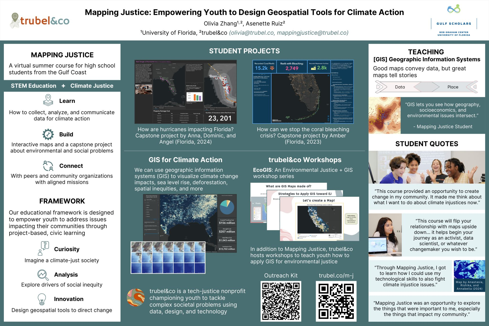

I have been working with trubel&co since December 2023 and have loved every moment of it, from helping with EcoGIS workshops to Mapping Justice. Having been born in New Orleans and raised in South Florida, the Gulf is a region especially close to my heart. When I learned that trubel&co is expanding the Florida Mapping Justice program to all Gulf Coast states, I was very excited to be able to help.

I am a Geography and Data Science student at the University of Florida, and I love all things related to geographic information systems (GIS) and climate action — both key components of what trubel&co teaches high school students in Mapping Justice. At the University of Florida, I was able to receive funding through the [Gulf Scholars Program](https://www.nationalacademies.org/our-work/gulf-scholars-program) to support my work with trubel&co this summer.

🗺️ Mapping Justice is a summer program teaching high school youth how to leverage data, design, and technology to address complex environmental challenges.

At the Gulf Scholars Conference, I presented about what Mapping Justice is, trubel&co’s mission, and our educational framework.

trubel&co intern Olivia presents about Mapping Justice on stage in front of the Gulf Scholars Conference attendees in a two-minute lightning talk.

Poster about Mapping Justice that Olivia presented in the conference’s student poster session.

My takeaways from the conference:

- The importance of community engagement, ensuring that we are co-creating with communities across the Gulf region.
- Science is interdisciplinary, and science communication is crucial to ensure that knowledge is made accessible to communities.
- Art is a great way to communicate science — telling stories with data.

During the conference, I had the incredible opportunity to meet students from across the Gulf Coast working on fascinating research and outreach projects. We got to connect with graduate students and professionals to get their advice in pursuing a career in science and sustainability. Looking forward, I am excited to continue helping with Mapping Justice and programs that contribute to climate justice.

Read [this post on trubel&co's blog](https://trubel.medium.com/reflecting-on-the-gulf-scholars-conference-in-mobile-alabama-29e8b5526197)!