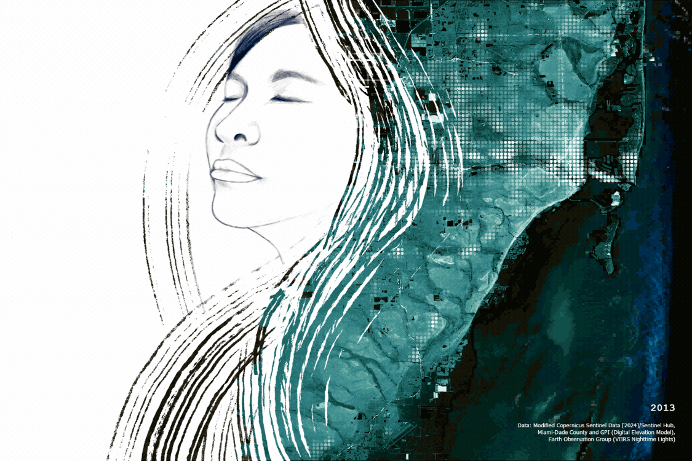
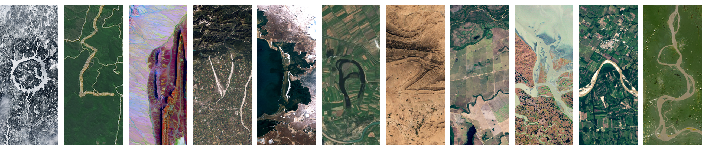

`Vibrance of Miami` takes a look at the diversity and resilience of Miami from space, using publicly-available data. Miami has grown so much over the years, and we can visualize this through how the lights of Miami, captured by satellites at night, have become brighter. Miami has so much diversity and color everywhere you look, and I hope that this artwork can reflect that vibrant joy.

## Data
The artwork features a Sentinel-2 satellite image from January 2024 downloaded from the [Sentinel Hub EO Browser](https://apps.sentinel-hub.com/eo-browser/), which is overlaid with the [2021 Miami-Dade County 5-foot Digital Elevation Model (DEM)](https://mdc.maps.arcgis.com/home/item.html?id=8c48d4bb8d9a42908f4936f698a2961a) created from 2021 LiDAR data, provided by Miami-Dade County and GPI Geospatial Inc. I then visualized annual median composites of VIIRS Nighttime Lights data provided by the [Earth Observation Group](https://eogdata.mines.edu/products/vnl/) for each year from 2013 to 2023. Using ArcGIS Pro, I converted each pixel to a point to better visualize the light values overlapping Miami's topography.

{{}}

## Artist Statement

I create digital artwork that reflects data about the world around us and the complicated emotions interconnected with our identities and experiences. Growing up in coastal cities, I have seen the reality of the climate crisis, but I found the massive amounts of data surrounding climate change and its impacts to be overwhelming. The creativity and flexibility of digital art allows me to better process climate change data—emphasizing both the urgency of the climate crisis and the hope for collaborative, equitable, and intersectional solutions.

My artwork reflects my personal experiences—being born in New Orleans just a few months before Hurricane Katrina hit, which became the costliest and one of the most destructive hurricanes in US history. I think of my mother’s strength as she drove my brother and I to safety amongst the chaos of evacuation. I think of how it’s shaped our lives, especially as we have faced more hurricanes since moving to South Florida. Art is my way of expressing all these emotions at once—strength and urgency, fear and hope.
