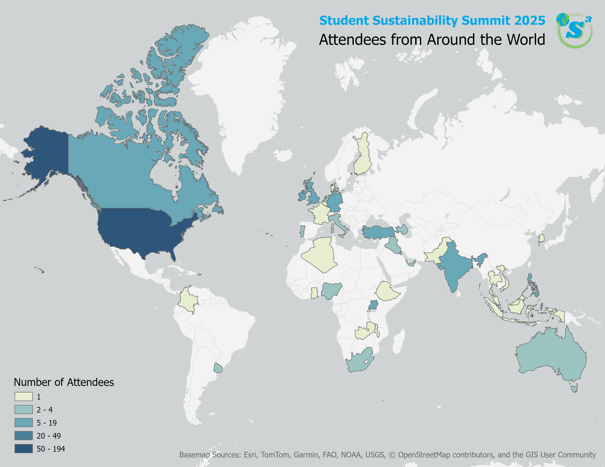

Combining my passions for climate action, data science, and geography, I had the incredible opportunity to present at the 2025 [Student Sustainability Summit](https://www.studentsustainabilitysummit.org/). Along with two other University of Florida students, I led a workshop introducing how to analyze spatial data about wildfires in California as part of our presentation about the intersection of data science and sustainability.

## Data Science for Sustainable Development

In August 2024, I co-founded [Data Science for Sustainable Development (DSSD)](https://gainesville.dssdglobal.org/) at the University of Florida as a chapter of the [nonprofit DSSD](https://dssdglobal.org/). DSSD’s mission is to apply <b>technology for positive impact</b> in support of the Sustainable Development Goals. We provide technical services to nonprofits, startups, and researchers for web development, data analysis, and other projects---all led by innovative teams of students passionate about data, computer science, and sustainability. At the Student Sustainability Summit, we presented about our ongoing projects and led an interactive coding workshop about analyzing fires in California.



## Data Analysis Workshop

In this workshop, we analyzed fires in California, created charts and interactive maps, and visualized fire impacts with satellite imagery. [View the workshop code here](https://github.com/via-zhang/data-workshops/blob/main/intro_fire_analysis.ipynb).

My favorite part of leading this workshop was being able to share my love of geospatial data science. We started by making line graphs and bar charts, and then made interactive maps where we could zoom in and out and click on fire points. Lastly, we visualized the impact of the fires by displaying the satellite images from before and after the fire to see how much they damaged the landscape. The goal of this workshop was to show how data science can help us understand important issues such as wildfire risk and visualize the data in different ways.

## Side Quest: Mapping the Summit’s Reach

I love to make maps whenever I can---and when the Student Sustainability Summit team reached out to me about making a map about the summit's attendees, I eagerly opened ArcGIS Pro and started mapping.
