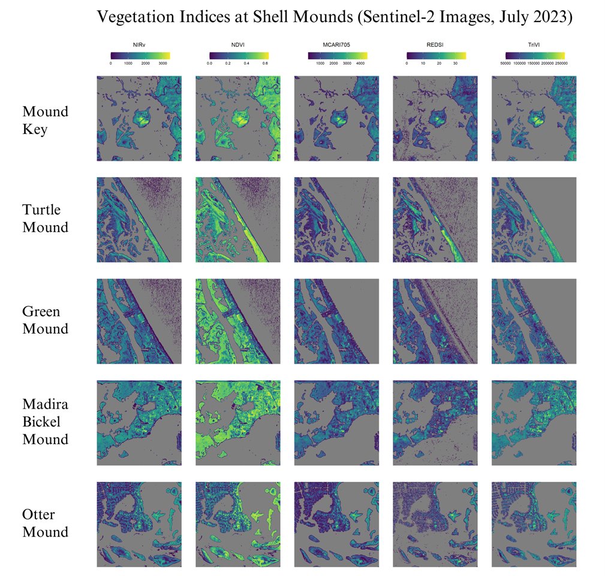
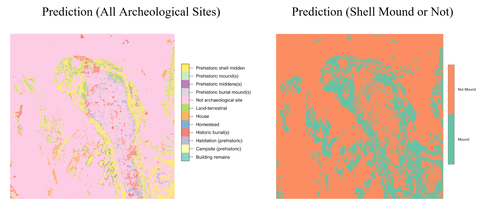
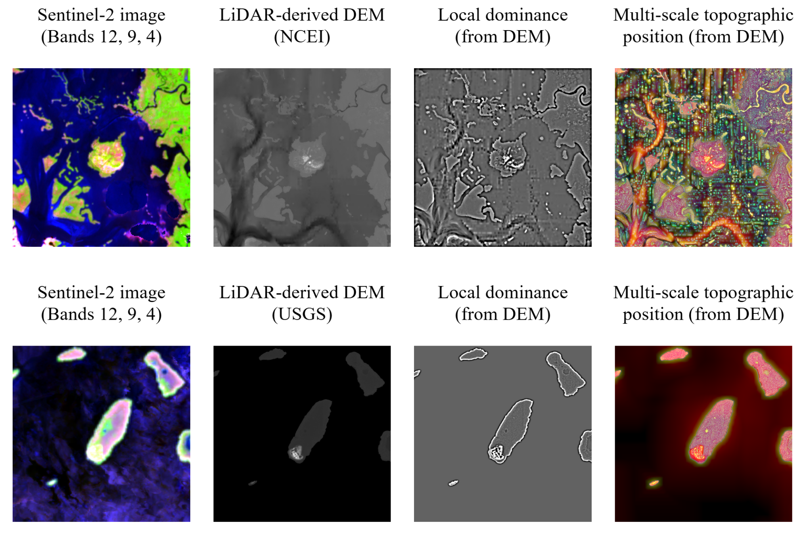
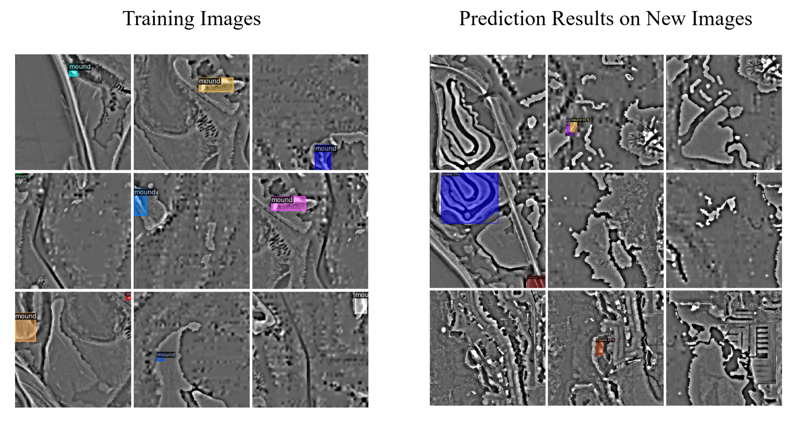
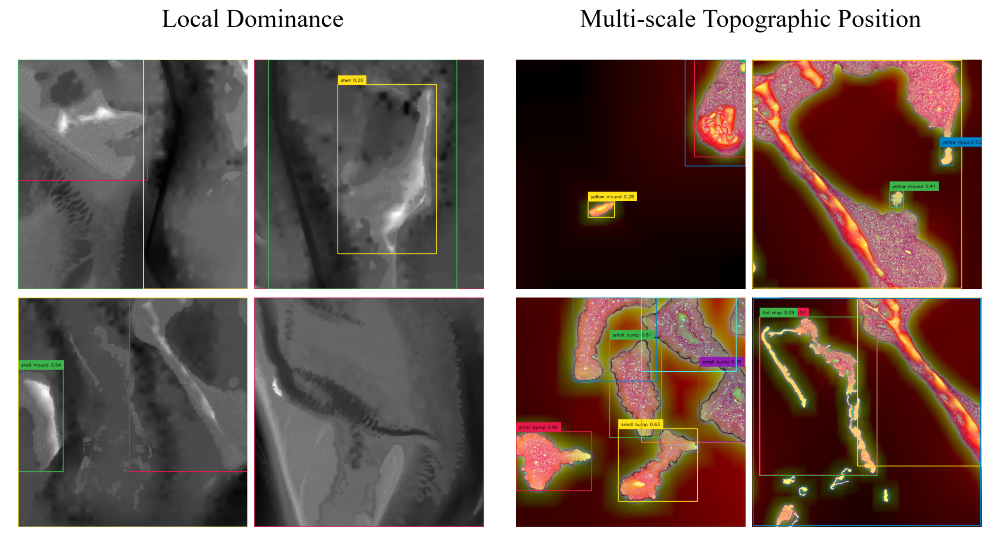
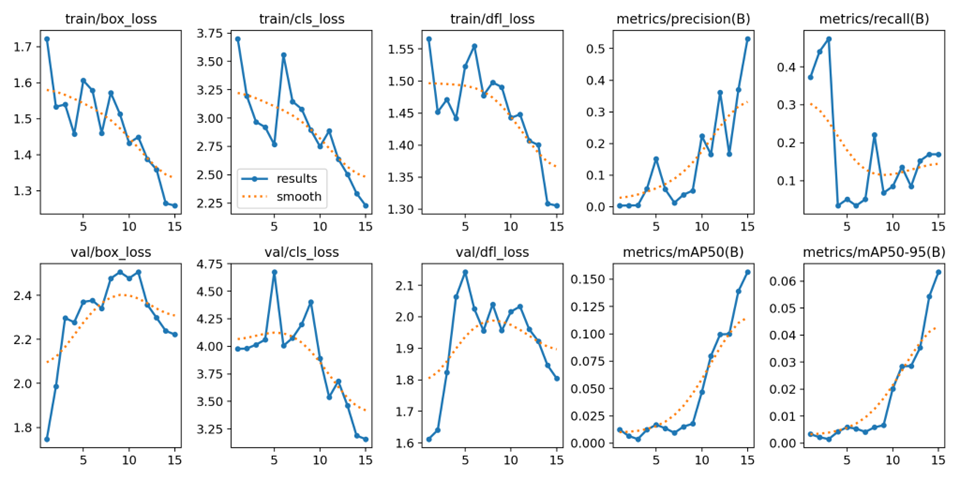
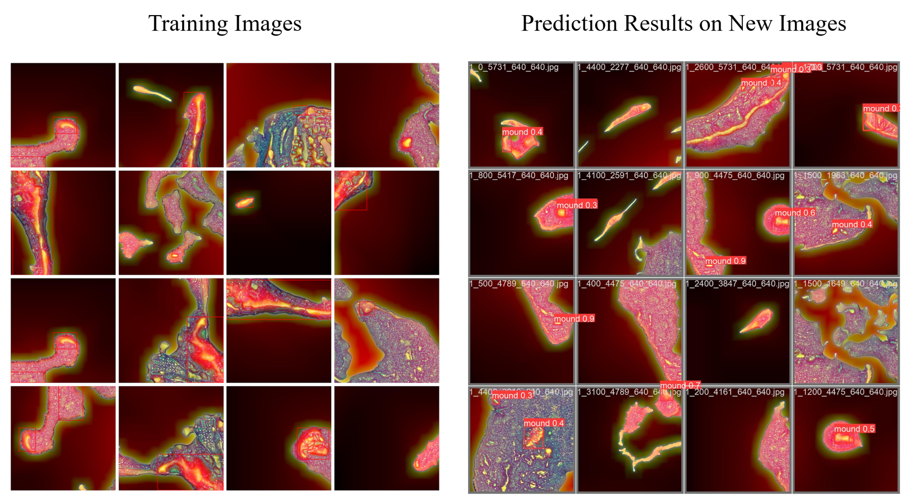
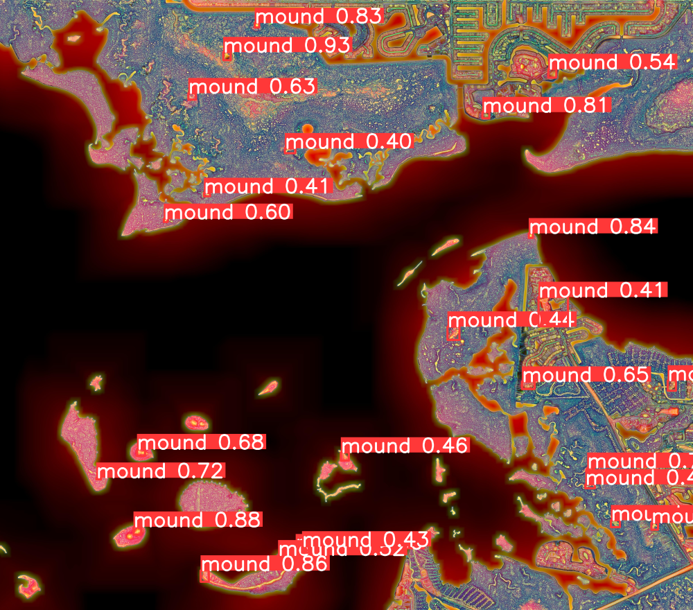
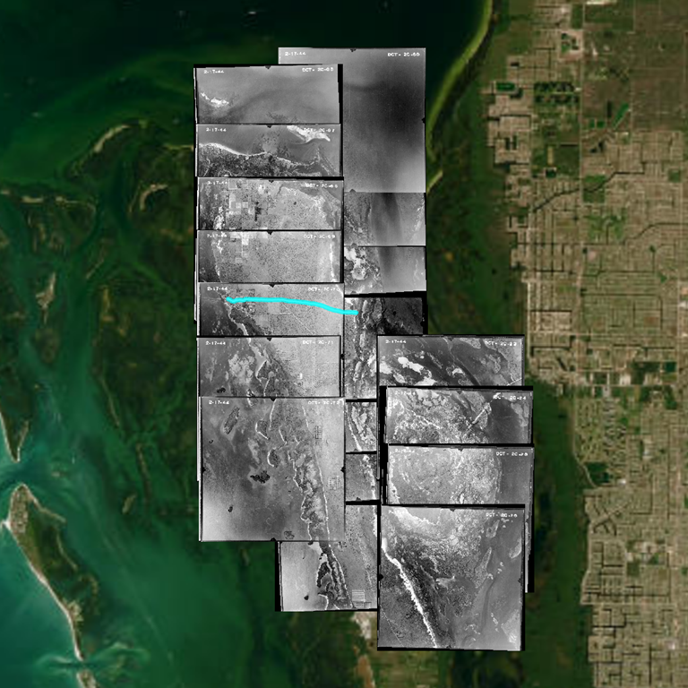

## Project Overview
Shell mounds, or shell middens, are hills of accumulated shell (clams, oysters, and whelks), mud bricks, pottery shards, and other objects built up by generations of Indigenous peoples (Orengo et al., 2020; Florida Natural Areas Inventory, 2010). Shell mounds, found along the coastlines of the southeastern United States (Florida Natural Areas Inventory, 2010), give us a look at the past, helping us understand the lives of communities from hundreds to thousands of years ago. As such, they are a crucial part of our cultural landscape—imprinted evidence of history and heritage on the natural landscape (Taylor & Lennon, 2011).

Shell mounds can be small or large—some acting as foundations on which new structures are built—with complex structures and ridges. The region studied through our research, the southwest coast of Florida, is the ancestral territory of the Calusa. The Calusa built complex shell mounds, middens, canals, and other earthworks (Charlotte County Historic Preservation Element, 2007), leaving a significant archeological imprint on the landscape. The accumulation of shell mounds provides archaeologists with crucial knowledge about past communities, from what types of food they ate to how large their communities were. Some sites, such as the shell midden on Josslyn Island, can protect from storm surges (Patterson, 2017, p. 34). However, many shell mounds have been destroyed or otherwise altered. For example, the Wightman Site on Sanibel Island was once a large shell midden, but has since been destroyed to make room for a housing development (Patterson, 2017, p. 48). This poses a significant question: How can we leverage emerging technologies to help preserve the shell mounds of Florida’s coast?

At the AI for Bio/Cultural Diversity Lab at the Florida Museum of Natural History, we aimed to answer this question by conducting AI-driven research about these significant archaeological sites. During the spring 2024 term, we tested different machine learning models to detect shell mounds in aerial images. With LiDAR elevation data and multi-scale topographic images of shell mounds across the west coast of Florida, we fine-tuned the following pre-existing models to detect shell mounds within images: Mask-RCNN, Grounding DINO, and YOLOv8.

Future work for the project involves 1) improving the performance of the object detection model with more training data and 2) using LiDAR and other remotely sensed data to expand our understanding of landscapes that have since been destroyed or sunken underwater.

## Land Acknowledgement
The University of Florida’s main campus is located on the ancestral territory of the Potano and of the Seminole peoples. The area of southwest Florida encompassed in our research is the ancestral territory of the Calusa. We acknowledge the long-lasting and devastating impact of colonization, and we honor and respect the Indigenous peoples who have, for thousands of years, lived and continue to live here.

## Current Results
We began by analyzing what types of data can distinguish shell mounds from the surrounding landscape—starting with satellite images from Sentinel-2. Sentinel-2 images have twelve spectral bands, and different combinations of these bands indicate various qualities about the vegetation, soil, and more. For example, the Normalized Difference Vegetation Index (NDVI) is calculated with the near infrared and red bands as (NIR - R) / (NIR + R), which helps us visualize healthy or unhealthy vegetation. Using the [rsi package in R](https://CRAN.R-project.org/package=rsi), we retrieved Sentinel-2 images around prominent shell mound locations like Mound Key and Otter Mound, and we viewed [over 150 spectral indices](https://github.com/awesome-spectral-indices/awesome-spectral-indices/blob/main/output/spectral-indices-table.csv). For the following vegetation indices, the shell mounds were especially prominent: Near-Infrared Reflectance of Vegetation (NIRv), Normalized Difference Vegetation Index (NDVI), Modified Chlorophyll Absorption in Reflectance Index (MCARI705), Red-Edge Disease Stress Index (REDSI), and Triangular Vegetation Index (TriVI).

{{}}

To train our machine learning model, we used the locations of archeological sites for the west coast of Florida from [Florida Master Site File](https://dos.fl.gov/historical/preservation/master-site-file/). Specifically, we used data about shell mounds and shell middens from Lee County and Charlotte County.

First, we tested random forest classification using the programming language R. We used a 12-band Sentinel-2 image of Pine Island and calculated the vegetation indices NDVI and TriVI. We tested two methods: 1) using 1000 points labeled with all categories of archeological sites from the Florida Master Site File, such as prehistoric mound(s), shell midden, canal, and agriculture/farm structure, and 2) using 1000 points labeled as either “mound” or “not mound.”

{{}}

After additional tests and finding that the results were not very accurate, we decided to 1) look more into object detection methods, and 2) focus on detecting shell mounds rather than multiple archaeological sites. Further, after reviewing previous research about detecting shell mounds and archaeological sites, we decided to use high-resolution elevation data rather than vegetation data—elevation is especially relevant because of the structure and height of shell mounds. Using the [Relief Visualization Toolbox](https://rvt-py.readthedocs.io/en/latest/index.html) (RVT), a set of tools to visualize elevation data, we processed LiDAR-derived digital elevation model (DEM) images to visualize local dominance and multi-scale topographic position.

The following figures show the Sentinel-2 image, LiDAR-derived digital elevation from the National Centers for Environmental Information (NCEI) and the United States Geological Survey (USGS), and the local dominance and multi-scale topographic position images made from the elevation data using RVT.

{{}}

### Object Detection Models

We fine-tuned three open-source object detection models: Mask-RCNN, Grounding DINO, and YOLOv8. These models have already been trained to recognize objects in millions of everyday images. While these models most likely will not recognize shell mounds right away, they can be fine–tuned—a process for further training a model to recognize new objects while keeping their old information. I learned that fine-tuning is more efficient than training a model from the beginning, as the pre-existing models provide a foundation for further training. We tested and fine-tuned the models using the programming language Python and open-source code.

The first model was Mask-RCNN, implemented in the [Detectron2](https://github.com/facebookresearch/detectron2) framework developed by Facebook AI Research, which draws boxes around different objects in an image and then segments (or traces out) the objects. We fine-tuned Detectron2 using [local dominance](https://rvt-py.readthedocs.io/en/latest/listofvis_localdom.html) images from the Relief Visualization Toolbox with LiDAR-derived elevation data from the National Centers for Environmental Information. In the local dominance images, lighter colors indicate areas that are higher than the surrounding land—making it helpful for identifying shell mounds. Once trained, the model was able to predict some of the shell mounds, but with low accuracy.

{{}}

The second model we tested was [Grounding DINO](https://github.com/IDEA-Research/GroundingDINO), which takes in a text prompt and identifies the prompt (which, in this case, is “shell mound” or a similar key phrase) within the image. The images shown below show using the pre-existing [Grounding DINO model](https://huggingface.co/spaces/merve/Grounding_DINO_demo) without any fine-tuning on local dominance and multi-scale topographic position images, using key phrases like “shell mound, “white mound,” “small bump” and “mound on flat map.” We are still in the process of finding a way to efficiently fine–tune Grounding DINO—this model requires the training data to be in a specific format, and the fine-tuning code is run in a slightly different environment than the other two models.

{{}}

After testing these first two models, we decided to use [multi-scale topographic position](https://rvt-py.readthedocs.io/en/latest/listofvis_mstp.html) images from the Relief Visualization Toolbox instead of local dominance. The multi-scale topographic position, also derived from elevation data, provides more detailed information—it shows the relative topographic position of each pixel across different spatial scales: local, meso, and broad (Lindsay et al., 2015).

The third model we tested was [YOLOv8](https://github.com/ultralytics/ultralytics) (You Only Look Once, version 8), the first version of which was created in 2015 as an efficient object detection approach. One challenge to training the models was that we had a small training dataset of around 75 images (640 by 640 pixels each). To solve this, we flipped and rotated around a fourth of the images to get a final training set of 131 images.

Below shows the results from fine-tuning the model with 15 epochs on 131 images. The fourth graph (precision) indicates the percent of model-identified mounds that are real mounds, and the fifth graph (recall) indicates the percent of real mounds identified by the model. As the model is trained on the dataset through each epoch, the performance generally improves. Overall, these charts tell us that the model can accurately identify some shell mounds, but there is still a lot of room for improvement.

{{}}

The model draws boxes around the predicted mounds and provides a number from 0 to 1 showing the confidence in the prediction (from 0 being not confident to 1 being the most confident). Below shows some images from the training dataset and the prediction results.

{{}}

Below is the result from running the model on one large image, and many of the predictions are correct. We used the Python [sahi library](https://github.com/obss/sahi) to divide the image into 224 “slices,” and then ran the model on the smaller slices—helping the model detect small shell mounds. Without sahi, the model did not predict any mounds in this image—most likely because it was too zoomed out.

{{}}

From exploring vegetation and elevation data to preparing 100+ training images, I learned a lot from testing the random forest classification and fine-tuning the three object detection models. There is future research to be done to improve the performance of the model with more training data while considering the performance metrics and results.

### Side Quest: Georeferencing Historical Aerial Images

A side project we worked on this semester was georeferencing [Aerial Photographs of Lee County - Flight 2C (1944)](https://ufdc.ufl.edu/UF00071762/00002/citation) from the U.S. Department of Agriculture, recorded in the University of Florida’s Map and Imagery Library. The aerial images were very high resolution and provided a look at past landscapes. Using georeferencing tools in ArcGIS Pro, I imported the photographs, specifically those showing Pine Island, to resize and re-project them into a format easier to use with geographic information systems (GIS). I compared roads, lakes, and other features of the landscape to locate the photographs on the map.

Viewing these historical photographs gives us insights into how the landscape, including shell mounds, looked in the past. These images can be used to help decipher qualities about Florida’s landscape that has since been transformed. Once enough images were georeferenced around Pine Island, we could identify traces of an old, dried-up canal, which is no longer visible today—the canal is traced in cyan in the screenshot below.

{{}}

## Next Steps
This research has various applications in archaeology and historic preservation—serving as a resource for us to understand the locations of archaeological sites and the imprints of past communities. As historic sites are increasingly threatened by sea level rise, extreme weather, and more issues exacerbated by climate change, historic preservation efforts are crucial to maintain and protect these sites.

Future work for this project includes finding more publicly-available high-resolution LiDAR data, further training the YOLOv8 model, and analyzing the model’s performance in detecting shell mounds. We can also further analyze how shell mounds and other archeological sites are impacted by climate change and extreme weather events like hurricanes. Using LiDAR data and machine learning methods, we can understand landscapes that have been destroyed or impacted by sea level rise.

As an undergraduate student at the University of Florida studying geography and data science, working on these projects has been an incredible learning experience—further motivating me to pursue a career in cultural geography and AI research. I learned how research and collaboration can contribute to historic preservation and help communities build resilience against climate change—leveraging data to better understand our cultural and natural landscapes.

## References

Charlotte County. (2007). Chapter 9: Historic Preservation Element, 1997-2010 Comprehensive Plan Archive. Charlotte County, https://www.charlottecountyfl.gov/core/fileparse.php/376/urlt/chapter_9.pdf

Florida Natural Areas Inventory. (2010). Guide to the natural communities of Florida: 2010 edition. Florida Natural Areas Inventory, Tallahassee, FL. https://www.fnai.org/species-communities/natcom-guide

Orengo, H.A., Conesa, F.C., Garcia-Molsosa, A., Lobo, A., Green, A.S., Madella, M., Petrie, C.A. (2020). Automated detection of archaeological mounds using machine-learning classification of multisensor and multitemporal satellite data. Proceedings of the National Academy of Sciences, 117(31), 18240–18250, https://doi.org/10.1073/pnas.2005583117

Lindsay, J.B., Cockburn, J.M.H., Russell, H.A.J. (2015). An Integral Image Approach to Performing Multi-Scale Topographic Position Analysis. Geomorphology, 245, 51–61. https://doi.org/10.1016/j.geomorph.2015.05.025

Patterson, D. (2017). A tour of the islands of Pine Island Sound, Florida: Their geology, archaeology, and history (W. H. Marquardt, Ed.; Ser. 2). Randell Research Center, Florida Museum of Natural History.

Taylor, K., & Lennon, J. (2011). Cultural landscapes: a bridge between culture and nature? International Journal of Heritage Studies, 17(6), 537–554. https://doi.org/10.1080/13527258.2011.618246

### Code and Packages

Bhattiprolu, S. (2023). Train custom instance segmentation model using Detectron2 - on your own dataset. https://github.com/bnsreenu/python_for_microscopists/blob/master/330_Detectron2_Instance_3D_EM_Platelet.ipynb

Heras, J. Augmenting a dataset for object detection in YOLO. (n.d.). https://github.com/joheras/CLoDSA/blob/master/notebooks/CLODSA_YOLO.ipynb

Liu, S., Zeng, Z., Ren, T., Li, F., Zhang, H., Yang, J., Li, C., Yang, J., Su, H., Zhu, J., et al. (2023). Grounding dino: Marrying dino with grounded pre-training for open-set object detection. https://github.com/IDEA-Research/GroundingDINO

Mahoney, M. (2024). rsi: Efficiently Retrieve and Process Satellite Imagery. R package version 0.1.0, https://CRAN.R-project.org/package=rsi.

Pebesma, E. (n.d.). Random Forest land use classification, 7. Statistical modelling with stars objects. https://r-spatial.github.io/stars/articles/stars7.html#random-forest-land-use-classification

Piotr S. (2023). How to Train YOLOv8 Object Detection on a Custom Dataset. Roboflow Blog, https://blog.roboflow.com/how-to-train-yolov8-on-a-custom-dataset/

R Core Team (2023). R: A Language and Environment for Statistical Computing. R Foundation for Statistical Computing, Vienna, Austria. https://www.R-project.org.

Siebring, J. (2023). GeoCOCO. https://github.com/jaspersiebring/GeoCOCO

Ultralytics. (n.d.). Model Training with Ultralytics YOLO. https://docs.ultralytics.com/modes/train/

Yuxin Wu, Alexander Kirillov, Francisco Massa, Wan-Yen Lo, and Ross Girshick. (2019). Detectron2. https://github.com/facebookresearch/detectron2

Žiga Kokalj, Žiga Maroh, Krištof Oštir, Klemen Zakšek and Nejc Čož. (2022). RVT Python library. https://github.com/EarthObservation/RVT_py

Zuwei Long, Wei Li. (2023). Open Grounding Dino: The third party implementation of the paper Grounding DINO. https://github.com/longzw1997/Open-GroundingDino

### Data

2018 USGS Lidar DEM: Southwest, FL. NOAA Office for Coastal Management. https://noaa-nos-coastal-lidar-pds.s3.amazonaws.com/dem/USGS_FL_Southwest_2018_9049/index.html

Aerial Photographs of Lee County - Flight 2C (1944), U.S. Department of Agriculture, Map and Imagery Library, George A. Smathers Libraries, University of Florida. https://ufdc.ufl.edu/UF00071762/00002/images

Cooperative Institute for Research in Environmental Sciences (CIRES) at the University of Colorado, Boulder. (2014). Continuously Updated Digital Elevation Model (CUDEM) - 1/9 Arc-Second Resolution Bathymetric-Topographic Tiles. NOAA National Centers for Environmental Information. https://doi.org/10.25921/ds9v-ky35

Florida Master Site File. Florida Division of Historical Resources, Florida Department of State. https://dos.fl.gov/historical/preservation/master-site-file/

NOAA NCEI Continuously Updated Digital Elevation Model (CUDEM) - Ninth Arc-Second Resolution Bathymetric-Topographic Tiles, NOAA National Centers for Environmental Information (NCEI). https://chs.coast.noaa.gov/htdata/raster2/elevation/NCEI_ninth_Topobathy_2014_8483/FL/index.html

