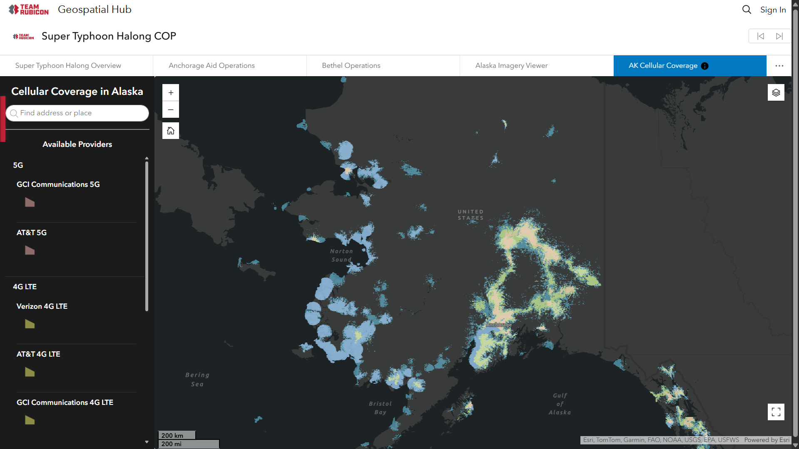

In 2025, I started volunteering with [Team Rubicon](https://teamrubiconusa.org/), a national nonprofit organization that organizes international disaster response efforts to disasters like hurricanes, wildfires, and floods. On their [GIS team](https://geo-teamrubiconusa.hub.arcgis.com/), I provide GIS support to a range of projects, from creating interactive dashboards for use in planning disaster response to labeling floodded roads and fallen trees in high-resolution satellite imagery taken in the aftermath of a disaster.

Living in South Florida, I have seen the impacts of hurricanes and other disasters on our communities. As a geography and data science student, much of my work and research involves geographic information systems (GIS), which allow us to visualize data on maps and analyze spatial patterns.

## Typhoon Halong
I created this dashboard showing cell coverage in Alaska, as part of a larger ArcGIS Hub site, to support planning and field coordination during the response to Typhoon Halong in Alaska.

## Hurricane Melissa
For this published [story map](https://arcg.is/0OXrfS), I created maps showing where Team Rubicon volunteers traveled to support disaster response in impacted regions.

