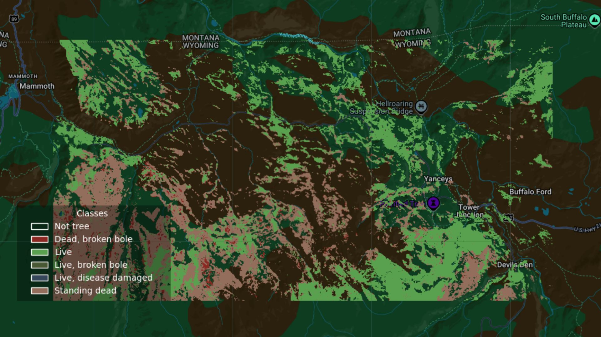
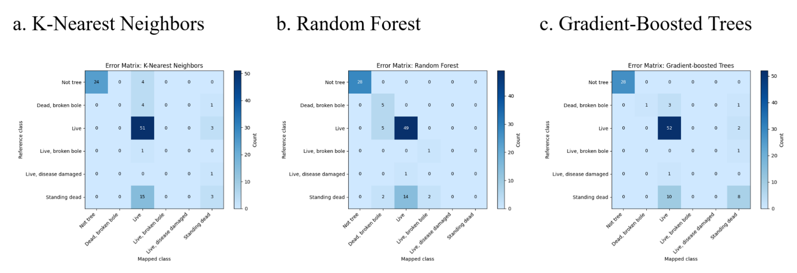

Understanding tree mortality over time provides crucial insights for habitat restoration, environmental modeling, conservation efforts, and more. However, accurate, high-resolution tree mortality data is often lacking, especially for expansive areas unfeasible for conducting field surveys.

Machine learning allows us to expand and map tree mortality across a region using sampled data. This report shares preliminary results comparing various machine learning methods to predict tree mortality and disease at a 10-meter resolution using the National Ecological Observatory Network (NEON)’s field survey data, paired with Google’s Satellite Embeddings, which distill satellite images, radar, digital elevation models, and climate simulations into annual, publicly-available imagery.

## Methods
### Data
The target variable was tree mortality, which comes from vegetation structure data from National Ecological Observatory Network (NEON)’s field surveys for Yellowstone National Park in 2023. This dataset, downloaded from the NEON API using R, includes a mortality classification for trees: live, live (broken bole), live (disease damaged), standing dead, dead (broken bole). In total, there were 97 labeled trees from the 2023 NEON field survey for the Yellowstone National Park NEON site. Over the Yellowstone National Park NEON site region, 100 points were randomly sampled to serve as the “non-tree” class so that the model would be able to differentiate trees from non-trees. These points were specifically sampled from areas where the normalized difference vegetation index (NDVI) from the Landsat 2023 annual composite was less than 0.5, indicating that those areas were most likely not heavily forested or vegetated.

The predictor variables came from Google’s Satellite Embeddings, which summarizes satellite images, radar, digital elevation models, and climate simulations into 10-meter resolution, 64-dimension annual layers (Brown et al., 2025). The satellite embeddings were accessed through Google Earth Engine and provide 64 variables for model training, each containing a scaled decimal value from -1 to 1.

### Models
Data processing and model training were completed using Google Earth Engine. The following machine learning methods were compared to classify tree mortality (live, dead, damaged, or diseased) at a 10-meter resolution: k-nearest neighbors, gradient-boosted trees, and random forest. From the data, containing 197 points with a tree mortality classification from NEON and 64 predictor variables from Google’s Satellite Embeddings, 80% were used for training and the other 20% for validation for all of the models.

## Results
As indicated in Table 1, gradient-boosted trees performed the best out of the 3 models tested, with a validation accuracy of 0.8636. The models predicted live trees and regions without trees most accurately, as indicated by the confusion matrices shown in Figure 2. Trees observed as standing dead were easily confused as live. The following classes had very few labels: dead (broken bole), live (broken bole), and liev (disease damaged). As a result, it is difficult to quantify the performance of the models on such few training and validation points for these specific tree mortality classes.

Table 1. Results of Machine Learning Models
| Model | Train Accuracy | Validation Accuracy |
| --- | --- | --- |
| K-Nearest Neighbors | 0.7290 | 0.8182 |
| Random Forest | 0.7757 | 0.7727 |
| Gradient-Boosted Trees | 0.8318 | 0.8636 |

Figure 1. Predictions of Tree Mortality from Gradient-Boosted Trees Model

Figure 2. Confusion Matrix of Machine Learning Models on Training Data

Connecting ground observations to remote sensing data, we are able to derive large-scale maps to quantify annual tree mortality. This research highlights the ability of emerging technologies like satellite embeddings along with publicly-available datasets and classification methods to provide insights into annual tree health across complex ecosystems.

## References
Brown, C. F. et al. (2025). AlphaEarth Foundations: An embedding field model for accurate and efficient global mapping from sparse label data, arXiv e-prints, Art. no. arXiv:2507.22291, 2025. https://doi.org/10.48550/arXiv.2507.22291.

NEON (National Ecological Observatory Network). Vegetation structure (DP1.10098.001), RELEASE-2025. https://doi.org/10.48443/653k-mf13. Dataset accessed from https://data.neonscience.org/data-products/DP1.10098.001/RELEASE-2025.
