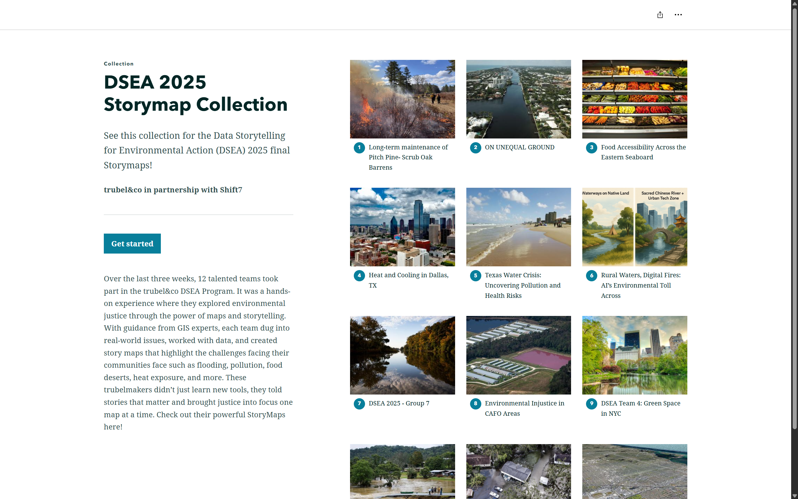

1. Mapping Justice: Gulf Coast

This summer, I supported [Mapping Justice](https://www.trubel.co/m-j), our 8-week summer program for high school students, where they learn about geographic information systems (GIS), environmental challenges along the Gulf Coast, and how they can design tools for impact. From helping with parts of the curriculum to editing recordings, I learned so much about all the behind-the-scenes work that ensures the program runs smoothly.

I am inspired by the students’ incredible work throughout the course of the program. You can view their [projects here](https://storymaps.arcgis.com/collections/2778e7dcdf294a378561f4b5a1dca8dd), exploring environmental issues along the Gulf region. Helping with this program reminded me of my first time learning about GIS in high school, and how I found it so fascinating how we can use GIS to uncover spatial patterns and tell stories with data.

2. Data Storytelling for Environmental Action

I also had the opportunity to support a new program, Data Storytelling for Environmental Action (DSEA), which we hosted in partnership with [shift7](https://shift7.com/). This program resonated with me as I am passionate about visualizing data and telling stories for environmental justice.

In this 3-week program, we provided an introduction to GIS, data analysis, and digital storytelling. I helped create parts of the curriculum, like how to find and add geospatial datasets using ArcGIS Online, how to visualize Justice40 data, and how to use analysis tools in ArcGIS Online. I also edited recordings of the program (including our guest speaker chats!) and provided GIS and data support.

You can view the teams’ incredible [projects here](https://storymaps.arcgis.com/collections/54b4b29ccd4f4592a1a9b1abf0f0e660).

3. Broward Youth Climate Action Fund

With generous support from Broward County’s [Youth Climate Action Fund](https://www.broward.org/Climate/pages/youthclimateactionfund.aspx), we were able to ensure that Mapping Justice supported youth from Broward County, Florida. As I have lived in Broward County for most of my life, this was a special opportunity to connect my current work at trubel&co with my community in South Florida.

4. Society for Conservation GIS Annual Conference

I had the opportunity to present about Mapping Justice and trubel&co at the Society for Conservation GIS (SCGIS) Conference in Shepherdstown, West Virginia from June 30th to July 2nd. The theme of the conference was *Geospatial Technology Innovations for Conservation*, which resonates with our mission at trubel&co.

5. Esri User Conference

From July 13th to 17th, I attended the Esri User Conference, where I got to meet some of the trubel&co team in person in San Diego, California!

I especially loved attending the Equity & Social Justice Special Interest Group, where we heard about exciting projects applying GIS for social justice. I also learned so much about geospatial AI capabilities throughout the conference, and especially at the AI Summit.

This conference showed me that there is so much you can do with GIS, from finding patterns in satellite imagery to connecting community initiatives. The possibilities are endless, but rooted in community and collaboration.

Part of the trubel&co team at the Esri User Conference. From left to right, pictured are Nick Okafor, Joan Jungbin Lee, Hiba Reyes, Olivia Zhang, and Katie Grillo.

Overall, this summer has been full of opportunities for growth and learning as I supported educational programs at trubel&co. I got to meet passionate youth from across the US who have such creative, innovative solutions to the problems they’re seeing in their communities. I learned so much about geospatial justice, educational programming, and data storytelling, which I look forward to carrying with me in my future work.

